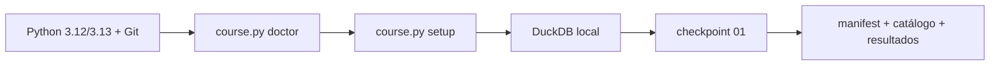

# Aula 0 — Prepare seu laboratório dbt sem sofrer com o ambiente

## Resultado da aula

Ao final, você terá validado o computador, instalado o laboratório isolado e executado o primeiro checkpoint sem conta cloud.

## Passo a passo

1. Escolha [instalação local](instalacao/README.md) ou [Codespaces](codespaces.md).
2. Execute `python course.py doctor` e corrija qualquer item marcado como `ERRO`.
3. Execute `python course.py setup`. A primeira execução baixa dependências.
4. Execute `python course.py checkpoint 01`.
5. Procure a mensagem `Checkpoint 01 OK`.
6. Se falhar, execute `python course.py support-report` e use o [modelo de ajuda](pedir-ajuda.md).

## O que o setup faz

- Cria um ambiente Python isolado dentro do laboratório.
- Instala versões fixadas de dbt Core, DuckDB, MetricFlow e dbt MCP.
- Baixa packages dbt.
- Testa a conexão com o arquivo DuckDB local.
- Não acessa Databricks e não solicita chaves.

## Material complementar

- [Quickstart manual do dbt](https://docs.getdbt.com/guides/manual-install?step=1) — dbt Labs, guia/EN, comparação com a instalação oficial; verificado em 2026-09-01.
- [Jaffle Shop com DuckDB](https://github.com/dbt-labs/jaffle_shop_duckdb) — dbt Labs, repositório/EN, outro laboratório local oficial; verificado em 2026-09-01.

