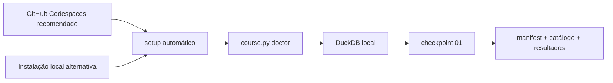
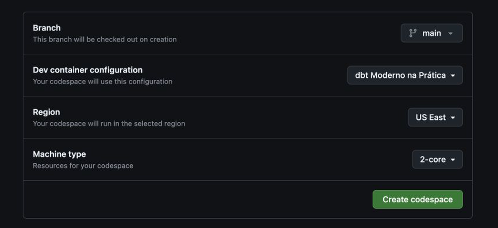

# Aula 0 — Prepare seu laboratório dbt sem sofrer com o ambiente

## Resultado da aula

Ao final, você terá criado o laboratório padronizado no GitHub Codespaces, validado o ambiente e executado o primeiro checkpoint sem conta cloud. A instalação local permanece como alternativa.

## Rota recomendada: Codespaces

**[Abra o laboratório configurado em uma máquina de 2 núcleos](https://github.com/codespaces/new?hide_repo_select=true&ref=main&repo=1354054687)** e siga o [tutorial ilustrado de Codespaces](codespaces.md).

Essa rota é recomendada porque todos recebem Python 3.12, a mesma configuração do VS Code e as mesmas dependências. Em contas pessoais GitHub Free, a franquia informada pelo GitHub em 2026-09-01 é de 120 core-hours e 15 GB-mês; com 2 núcleos, são aproximadamente 60 horas ativas por ciclo mensal.

## Passo a passo

1. Crie o ambiente pela [rota recomendada no Codespaces](codespaces.md). Se preferir trabalhar offline, use a [instalação local](instalacao/README.md).
2. No Codespaces, aguarde o `setup` automático terminar. Na instalação local, execute `python course.py setup`.
3. Execute `python course.py doctor`. Se aparecer **Ambiente preparado**, não execute `setup` novamente; corrija apenas itens marcados como `ERRO`.
4. Execute `python course.py paths` para conferir os caminhos detectados do dbt, DuckDB, profile, banco e artifacts.
5. Execute `python course.py checkpoint 01`.
6. Procure a mensagem `Checkpoint 01 OK`.
7. Opcionalmente, execute `python course.py data-ui` e use o explorador autoral do curso sobre a cópia somente leitura, pela porta privada 4213.
8. Ao terminar no Codespaces, pare o ambiente para interromper o consumo de processamento.
9. Se falhar, execute `python course.py support-report` e use o [modelo de ajuda](pedir-ajuda.md).

## O que o setup faz

- Cria um ambiente Python isolado dentro do laboratório.
- Instala versões fixadas de dbt Core, DuckDB, MetricFlow e dbt MCP.
- Baixa packages dbt.
- Testa a conexão com o arquivo DuckDB local.
- Registra os caminhos efetivos em `build/environment-info.json`; ao reabrir o Codespace, o `postStartCommand` restaura o ambiente e atualiza esse arquivo.
- Não acessa Databricks e não solicita chaves.

No Codespaces, essas ações são iniciadas automaticamente pelo `postCreateCommand` versionado no repositório.

> `^C` e `KeyboardInterrupt` significam que o processo foi interrompido pelo usuário. Na primeira preparação, aguarde as três etapas terminarem. Reexecutar `setup` depois disso apenas confirma o ambiente e pula instalações já concluídas.

> O dbt Power User não é necessário. Se o editor abrir o assistente dessa extensão, feche-o e siga apenas os comandos `course.py`. O [guia de Codespaces](codespaces.md) explica por que o dbt 1.11 mostrado pelo assistente não é o dbt 1.12.3 do laboratório.

> O explorador DuckDB é uma interface autoral e opcional do curso. Ele opera sobre uma cópia somente leitura, não substitui os comandos dbt e não é necessário para concluir nenhum checkpoint. A DuckDB UI oficial não é usada no Codespaces por sua limitação documentada com túneis e containers.

## Material complementar

- [Quickstart manual do dbt](https://docs.getdbt.com/guides/manual-install?step=1) — dbt Labs, guia/EN, comparação com a instalação oficial; verificado em 2026-09-01.
- [Jaffle Shop com DuckDB](https://github.com/dbt-labs/jaffle_shop_duckdb) — dbt Labs, repositório/EN, outro laboratório local oficial; verificado em 2026-09-01.
- [GitHub Codespaces: criar um ambiente](https://docs.github.com/en/codespaces/developing-in-a-codespace/creating-a-codespace-for-a-repository) — GitHub, documentação/EN, base oficial do caminho recomendado; verificado em 2026-09-01.
- [Limitação da DuckDB UI em containers](https://github.com/duckdb/duckdb-ui/issues/22) — DuckDB, issue oficial/EN, motivo para o explorador autoral; verificado em 2026-09-02.
- [Segurança das portas no Codespaces](https://docs.github.com/en/codespaces/reference/security-in-github-codespaces) — GitHub, documentação/EN, portas encaminhadas privadas por padrão; verificado em 2026-09-02.
