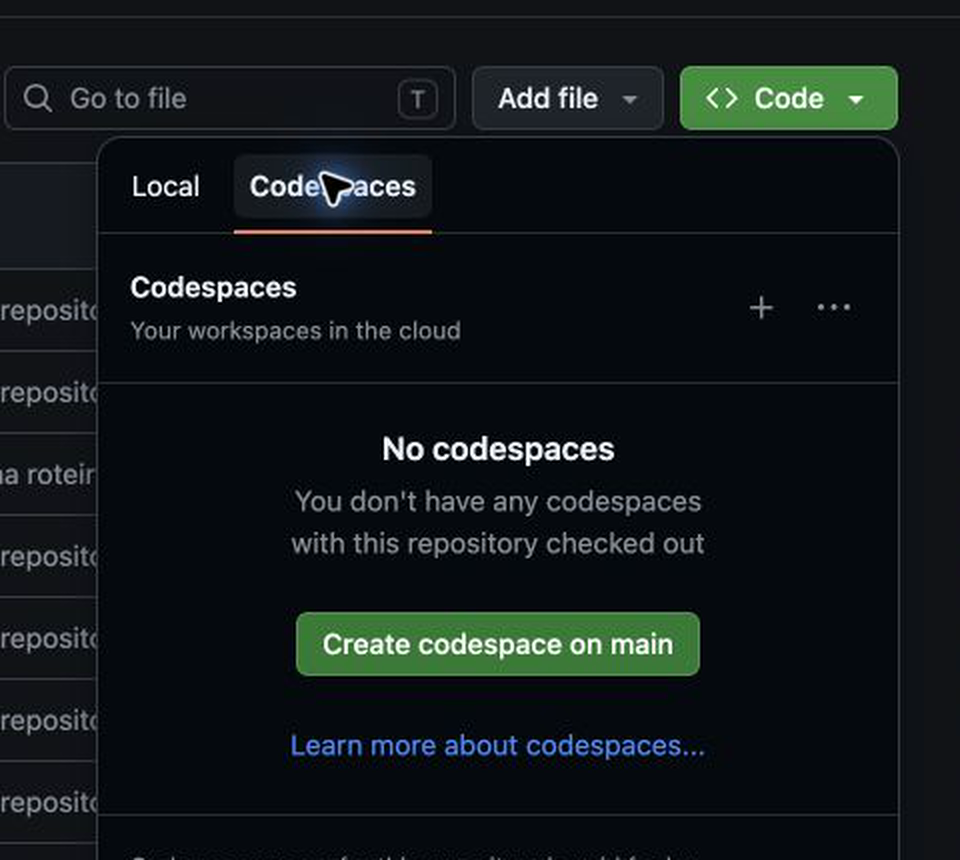
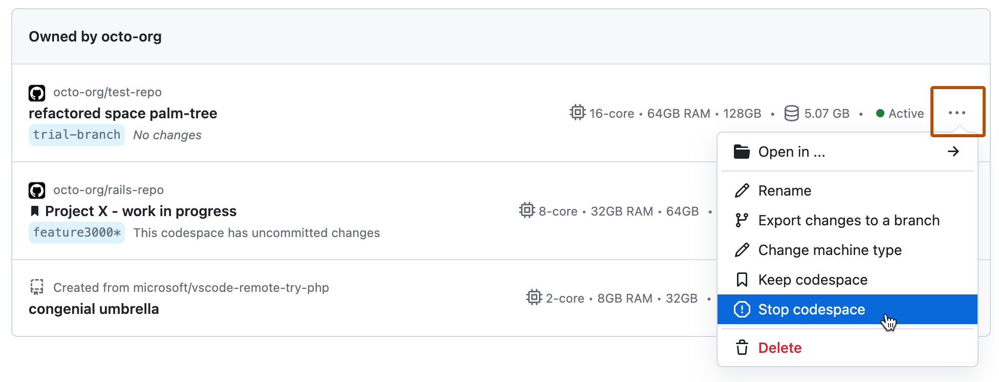

# GitHub Codespaces

O GitHub Codespaces é o **ambiente recomendado para acompanhar o curso**. Ele abre o mesmo repositório em um VS Code no navegador, com Python 3.12, dbt Core e DuckDB preparados pela configuração versionada em `.devcontainer/devcontainer.json`.

Isso reduz diferenças entre Windows, macOS e Linux. A instalação local continua disponível como alternativa para quem precisa trabalhar offline ou não deseja usar a franquia do GitHub.

**[Abrir o laboratório no GitHub Codespaces](https://github.com/codespaces/new?hide_repo_select=true&ref=main&repo=1354054687)**

## O que você precisa

- Uma conta pessoal no GitHub Free, Pro ou Student.
- Navegador atualizado e conexão com a internet.
- Nenhuma instalação local de Python, Git, dbt ou DuckDB.
- Nenhuma conta dbt Platform, Databricks ou chave de IA.

## Franquia gratuita e escolha da máquina

Em 1º de setembro de 2026, uma conta pessoal **GitHub Free** inclui 120 core-hours e 15 GB-mês de armazenamento para Codespaces. Como o curso usa uma máquina de **2 núcleos**, isso equivale a aproximadamente 60 horas ativas por ciclo mensal. Contas Pro e estudantes verificados possuem limites diferentes.

Regras para não consumir além do necessário:

1. Mantenha a opção **2-core**.
2. Pare o Codespace ao terminar cada aula.
3. Exclua ambientes antigos quando não precisar preservar os arquivos.
4. Consulte o consumo em **Settings → Billing and licensing → Metered usage**.
5. Se houver forma de pagamento cadastrada, configure um orçamento que interrompa o uso no limite desejado.

Sem forma de pagamento válida, o GitHub informa que o uso é bloqueado quando a franquia termina; ele volta quando o ciclo mensal é renovado.

## Passo 1 — abra a opção Codespaces

Entre no GitHub, abra o [repositório do curso](https://github.com/AnselmoBorges/dbt-moderno-na-pratica), selecione **Code**, depois **Codespaces** e escolha **Create codespace on main**.



> Captura do GitHub.com em 2026-09-01. A interface pode mudar; procure os mesmos nomes descritos no texto.

O link direto no início desta página leva à mesma configuração.

## Passo 2 — confirme a configuração econômica

Na tela de criação, confirme:

- **Branch:** `main`;
- **Dev container configuration:** `dbt Moderno na Prática`;
- **Machine type:** `2-core`;
- **Region:** pode ser a região disponível mais próxima.


Depois, selecione **Create codespace**. A criação consome a franquia pessoal de Codespaces da conta conectada.

## Passo 3 — aguarde a preparação automática

O navegador abrirá um VS Code. Na primeira criação, o GitHub executa automaticamente:

```text
postCreateCommand: python course.py setup
postStartCommand:  python course.py doctor && python course.py paths
```

Não interrompa o primeiro `setup`. O terminal deve terminar com **Ambiente pronto** e o diagnóstico deve mostrar os itens principais como `OK`. Se o terminal não estiver visível, abra **Terminal → New Terminal**.

### Não execute o assistente “Get Started with dbt Power User”

O curso **não precisa do dbt Power User**. Essa extensão de terceiros pode criar outro ambiente, executar um dbt global e procurar `profiles.yml` em `~/.dbt`, enquanto o laboratório usa:

- `dbt-core 1.12.3` no ambiente isolado `lab/dabdbt/.venv`;
- o perfil versionado em `lab/dabdbt/dbt_profiles`;
- o launcher `course.py`, que escolhe ambos automaticamente.

Ao reabrir o Codespace, a configuração restaura o `PATH`, aponta para o profile do
curso e atualiza `build/environment-info.json`. Para ver os caminhos realmente
detectados do Python, dbt Core, módulo DuckDB, banco, profiles e artifacts, execute:

```bash
python course.py paths
```

Os comandos do curso usam esses caminhos diretamente. Não é necessário ativar a
`.venv`, mesmo depois de parar e iniciar o Codespace novamente.

Se aparecer uma aba **Get Started with dbt Power User**, feche-a sem selecionar versão nem executar **Validate Setup**. Em um Codespace antigo, abra **Extensions**, procure **dbt Power User** e escolha **Disable (Workspace)** ou **Uninstall**. Novos Codespaces criados a partir da configuração atual não instalam essa extensão.

A extensão oficial da dbt Labs também não é pré-requisito nesta temporada: sua experiência atual usa o Fusion em preview, enquanto as aulas executam o dbt Core 1.12 estável. O editor continua oferecendo terminal, SQL e YAML sem essas extensões.

## Passo 4 — valide o primeiro checkpoint

No terminal do Codespaces, execute:

```bash
python course.py doctor
python course.py checkpoint 01
```

Resultado esperado:

```text
OK  Python: 3.12.x
OK  Git
OK  Espaço livre
OK  Permissões
OK  Arquivos do curso
OK  dbt Core do curso: 1.12.3
Ambiente preparado. Você já pode executar o checkpoint.

Checkpoint 01 OK
```

No Codespaces, não repita `setup` quando o diagnóstico disser **Ambiente preparado**. Se a criação automática tiver sido interrompida, execute `python course.py setup` uma vez e aguarde todas as três etapas; não pressione `Ctrl+C` enquanto `dbt deps` estiver carregando.

O setup instala separadamente o motor Python e a CLI oficial do DuckDB, ambos na versão fixada do curso. Depois de atualizar um Codespace criado anteriormente, execute novamente:

```bash
python course.py setup
python course.py paths
```

O segundo comando deve mostrar `duckdb.executable`. Os comandos do curso usam o caminho completo da `.venv`, portanto não dependem do `PATH`. Se quiser abrir o terminal nativo manualmente, use o caminho exibido ou, com a `.venv ativa`, execute `duckdb`.

## Explore as tabelas graficamente — opcional

Depois de concluir o checkpoint 01, inicie a interface do DuckDB:

```bash
python course.py data-ui
```

O Codespaces avisará que a porta **4213** está disponível. Escolha **Open in Browser** ou abra a guia **Ports** e selecione **Explorador DuckDB**. A porta permanece **Private**, exigindo autenticação na sua conta GitHub; não a torne pública.

A interface autoral do curso mostra schemas, tabelas e resultados SQL. O comando cria `build/data-explorer/course-snapshot.duckdb`, uma cópia aberta somente para leitura, para que a exploração não modifique nem bloqueie o arquivo usado pelo dbt. Para atualizar os dados exibidos, encerre com `Ctrl+C` e execute o comando novamente.

Essa interface não é a DuckDB UI oficial nem uma reprodução de sua tela. A extensão oficial atualmente escuta apenas em `localhost`; o projeto mantém um issue aberto sobre execução em containers, e há um relato com o mesmo erro `DataView` em acesso por túnel. O explorador do curso liga-se ao endereço aceito pelo encaminhamento de portas do Codespaces e não baixa componentes adicionais. Ele continua opcional: nenhum checkpoint depende da interface gráfica.

### Alternativa avançada — DuckDB UI oficial por túnel

Quem quiser conhecer a interface oficial pode usá-la sem passar pelo domínio `app.github.dev`. Essa rota exige o [GitHub CLI](https://cli.github.com/) instalado também no computador do aluno.

No terminal do Codespaces:

```bash
python course.py official-data-ui
```

Não abra o link automático do Codespaces. No computador local, dentro de uma cópia do repositório, execute:

```bash
gh auth refresh -h github.com -s codespace
python course.py codespace-ui-tunnel
```

A autorização é necessária apenas na primeira vez. Se houver mais de um Codespace, o GitHub CLI solicitará a escolha. Também é possível informar o nome explicitamente:

```bash
python course.py codespace-ui-tunnel --codespace NOME_DO_CODESPACE
```

O navegador será aberto em `http://localhost:4213`. Mantenha os dois terminais abertos; `Ctrl+C` encerra cada processo. Essa alternativa é opcional e não substitui o explorador recomendado, pois requer preparação no computador local.

## Passo 5 — pare o ambiente ao terminar

Abra [github.com/codespaces](https://github.com/codespaces), localize o ambiente, selecione `…` e escolha **Stop codespace**. Parar interrompe o consumo de processamento; o armazenamento continua sendo contabilizado enquanto o Codespace existir.



> Captura oficial da documentação GitHub, CC BY 4.0, fixada no commit registrado no catálogo de ativos.

Para continuar outra aula, volte à página de Codespaces e abra o mesmo ambiente. Para liberar armazenamento, use **Delete** somente depois de salvar qualquer alteração que queira manter.

## Se algo der errado

| Sintoma | O que fazer |
|---|---|
| A opção Codespaces não aparece | Confirme que você está conectado a uma conta pessoal e abra o link direto desta página. |
| A franquia terminou | Aguarde a renovação mensal ou use a instalação local; não é necessário contratar um plano para continuar o curso. |
| O setup foi interrompido | Execute `python course.py setup` novamente. O processo é repetível. |
| Power User mostra dbt 1.11, `profiles.yml` ausente ou projeto inválido | Feche o assistente e desabilite a extensão. Execute `python course.py doctor`; rode `setup` somente se o ambiente não estiver preparado e depois siga para `checkpoint 01`. |
| O terminal mostra Python diferente de 3.12 | Confirme que o dev container selecionado é `dbt Moderno na Prática` e recrie o Codespace. |
| O checkpoint falha | Execute `python course.py support-report` e use o [modelo para pedir ajuda](pedir-ajuda.md). |
| O explorador não abre | Atualize o repositório, execute novamente `python course.py setup` e mantenha o terminal com `data-ui` aberto. Na guia **Ports**, abra a porta privada 4213. |
| Aparece `Initialization Error` ou `DataView` | Você abriu a DuckDB UI oficial antiga. Encerre o processo, atualize o repositório e execute `python course.py data-ui`; a tela correta diz **interface autoral do curso**. |
| Quero usar a DuckDB UI oficial | Use `official-data-ui` no Codespaces e `codespace-ui-tunnel` no computador local; nunca abra a UI oficial pelo domínio `app.github.dev`. |

## Como salvar seu progresso

O Codespace preserva os arquivos enquanto existir. Como alunos não têm permissão de escrita no repositório original, faça um fork se quiser publicar alterações na própria conta. Para apenas executar os checkpoints, nenhum fork é necessário.

## Material complementar

- [Criar um codespace](https://docs.github.com/en/codespaces/developing-in-a-codespace/creating-a-codespace-for-a-repository) — GitHub, documentação/EN; verificado em 2026-09-01.
- [Uso incluído e cobrança](https://docs.github.com/en/billing/concepts/product-billing/github-codespaces) — GitHub, documentação/EN; verificado em 2026-09-01.
- [Aproveitar melhor a franquia incluída](https://docs.github.com/en/codespaces/troubleshooting/troubleshooting-included-usage) — GitHub, documentação/EN; verificado em 2026-09-01.
- [Parar e iniciar um Codespace](https://docs.github.com/en/codespaces/developing-in-a-codespace/stopping-and-starting-a-codespace) — GitHub, documentação/EN; verificado em 2026-09-01.
- [Extensão dbt Power User](https://marketplace.visualstudio.com/items?itemName=innoverio.vscode-dbt-power-user) — Altimate AI, marketplace/EN; extensão de terceiros e opcional, não utilizada pelo curso; verificado em 2026-09-01.
- [Extensão oficial da dbt Labs](https://marketplace.visualstudio.com/items?itemName=dbtLabsInc.dbt) — dbt Labs, marketplace/EN; usa Fusion e está identificada como preview, portanto permanece fora do ambiente open/stable; verificado em 2026-09-01.
- [DuckDB UI](https://duckdb.org/docs/current/core_extensions/ui) — DuckDB, documentação/EN; referência da extensão oficial não utilizada no Codespaces; verificado em 2026-09-02.
- [Limitação da DuckDB UI em containers](https://github.com/duckdb/duckdb-ui/issues/22) — DuckDB, issue oficial/EN; servidor limitado a localhost; verificado em 2026-09-02.
- [Erro DataView ao usar túnel](https://github.com/duckdb/duckdb-ui/issues/186) — DuckDB, issue oficial/EN; reprodução do erro observado; verificado em 2026-09-02.
- [Segurança das portas no Codespaces](https://docs.github.com/en/codespaces/reference/security-in-github-codespaces) — GitHub, documentação/EN; portas encaminhadas são privadas por padrão; verificado em 2026-09-01.
