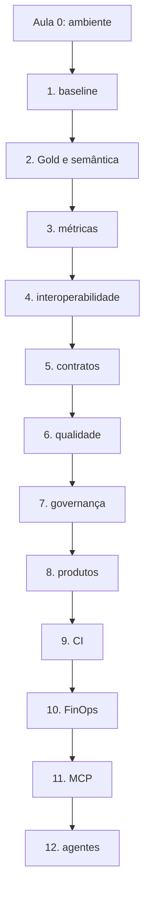

# Mapa do curso e checkpoints



Cada checkpoint é cumulativo e usa o estado final do projeto para isolar a capacidade focal:

```bash
python course.py checkpoint 01
python course.py checkpoint 02
# ...
python course.py checkpoint 12
```

Os episódios 13–16 são uma segunda temporada proprietária. Eles não fazem parte da validação local e não serão apresentados como executados sem acesso legítimo.

## Material complementar

- [dbt Learn](https://www.getdbt.com/dbt-learn) — dbt Labs, cursos/EN, trilhas oficiais complementares; verificado em 2026-09-01.

