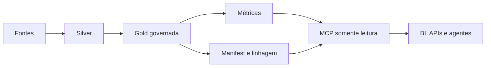

# Dossiê — dbt Moderno na Prática: da Gold aos Agentes de IA

**Data de corte:** 1º de setembro de 2026
**Baseline de produção:** dbt Core 1.12, suportado e estável
**Regra editorial:** primeiro recursos open source e estáveis; serviços proprietários entram somente na segunda temporada. Beta e preview aparecem apenas no quadro “Radar”.

## Resumo executivo

A revisão do conteúdo real da playlist mudou o ponto de partida. A aula teórica oferece uma boa introdução a modelos, `ref`, seeds, snapshots, testes, documentação, linhagem, perfis e materializações. Os cinco hands-ons, porém, param na configuração local, carga de seeds, criação de modelos Silver/Gold e execução seletiva. Incrementais, testes, documentação, linhagem e deploy aparecem como explicação ou promessa, não como implementação completa.

O projeto privado auditado é mais maduro que a playlist e que o laboratório público: contém múltiplos domínios dbt, Databricks Asset Bundles, CI/CD, Unity Catalog, exposures para aplicações, contratos, unit tests, `groups` e `access`. As lacunas reais são métricas como código, versionamento efetivo, freshness executável, CI baseada em artifacts/state e prova de eficiência dos incrementais.

A tese da nova série permanece válida e ficou mais forte:

*Diagrama conceitual autoral. Fonte editável: [`dossier-architecture.mmd`](../assets/diagrams/source/dossier-architecture.mmd).*

Gold e camada semântica não são sinônimos. A Gold materializa regras; a camada semântica declara grão, entidades, dimensões, métricas e caminhos de junção. Para um agente, essa combinação reduz decisões livres e torna a resposta auditável. Economia de tokens e consultas é uma hipótese que o laboratório mede; não é uma promessa automática.

## 1. O que a playlist realmente cobre

A auditoria completa, com timestamps e correções, está em [`auditoria-playlist.md`](auditoria-playlist.md). O resumo é:

| Vídeo | Conteúdo efetivamente demonstrado | Situação |
|---|---|---|
| [Teoria](https://www.youtube.com/watch?v=ZAgoqhlR95g) | papel do dbt, DAG, modelos, `ref`, materializações, testes/docs/snapshots conceituais, profiles e CI/Git | base conceitual forte; exemplos e afirmações precisam atualização |
| [Hands-on 1](https://www.youtube.com/watch?v=4TqyFTXbzIc) | apresentação do projeto, ferramentas e próximos passos | introdução; não cria os modelos anunciados |
| [Hands-on 2](https://www.youtube.com/watch?v=8AnaWYgeCuA) | Git, virtualenv, instalação do adapter, `dbt init`, profile e pastas | não implementa incremental |
| [Hands-on 3](https://www.youtube.com/watch?v=W8sZcY3FbhE) | `profiles.yml`, targets, `dbt_project.yml`, cópia dos CSVs, `dbt seed` e DuckDB | não implementa tests/docs |
| [Hands-on 4](https://www.youtube.com/watch?v=CujFYRjXRXE) | staging, `ref`, alias, precedência de configuração, table versus view | lineage e incremental apenas conceituais |
| [Hands-on 5](https://www.youtube.com/watch?v=NTZc7D4Zlok) | modelo Gold com join/CTE, `dbt run` e seleção de modelo | não demonstra deploy; promete tests/docs futuros |

### Correções editoriais essenciais

- Instalação local deve fixar um adapter compatível, como `dbt-duckdb`; não ensinar apenas `pip install dbt`.
- Snapshot registra mudanças históricas, especialmente dimensões lentamente mutáveis; não deve ser vendido primariamente como ferramenta de economia incremental.
- Testes reduzem risco, mas não garantem que produção nunca quebrará.
- CTE melhora legibilidade e modularização; performance depende do otimizador, materialização e engine.
- `ref` cria dependência e linhagem de DAG; documentação de tabelas e colunas continua sendo trabalho explícito.
- Curso Fundamentals e exame de certificação são coisas diferentes; preço e disponibilidade devem ser consultados antes da gravação.
- Core, Developer gratuito, Platform contratada, Fusion e Core 2.0 precisam ser apresentados como produtos/licenças/maturidades distintas.

## 2. Auditoria anonimizada do projeto privado

A auditoria somente leitura usou o commit `0683a9f50cd156deeeb6649a071de5c008468287`. O relatório está em [`auditoria-projeto-privado.md`](auditoria-projeto-privado.md). Nenhum nome de cliente, pessoa, e-mail, caminho interno, identificador cloud ou trecho proprietário foi incorporado.

### Capacidades comprovadas

- dez projetos dbt e um template, organizados por domínios;
- Databricks Asset Bundles e workflows por projeto;
- modelos Bronze/Silver/Gold, documentação e tags do catálogo;
- `groups`, owners e `access: private/protected/public` em projetos mais maduros;
- contratos aplicados em modelos Gold;
- unit tests de regras funcionais;
- exposures de dashboards, aplicações analíticas e assistentes;
- integração arquitetural com catálogo, espaço conversacional e Teams.

### Lacunas e riscos comprovados

- nenhum semantic model ou métrica como código localizado;
- model versions e source freshness aparecem em documentação, não como interfaces executáveis;
- workflows executam projetos completos; não foi encontrada seleção `state:modified` nem `--defer`;
- modelos incrementais usam estratégias como `merge`, porém sem `is_incremental()` encontrado nos modelos auditados, podendo reler toda a origem;
- a flag de microbatch aparece em vários projetos, sem `event_time`, `batch_size` ou `lookback` suficientes para comprovar microbatch real;
- faixas de versão variam entre `dbt-databricks >=1.8,<2.0` e `>=1.11,<2.0`;
- flags de materialização/formatos devem ser confrontadas com a versão estável do adapter antes de virarem recomendação.

### Tradução segura para Olist

| Padrão real | Implementação pública no laboratório |
|---|---|
| Gold consumida por dashboard/assistente | `commerce_orders` e exposure do agente |
| contratos em produtos Gold | `order_metrics` v1/v2 com contrato enforced |
| owners, groups e access | grupo `commerce`, interfaces públicas e modelos internos |
| unit tests de regras | prazo de entrega, receita reconhecida e status |
| incremental possivelmente ineficiente | `orders_s` com `unique_key` e filtro `is_incremental()` |
| flag sem comportamento comprovado | microbatch só é discutido quando há `event_time` e medição |
| CI integral | comparação reproduzível com artifacts e `state:modified+` |

## 3. Matriz “já abordado × lacuna × tendência”

| Tema | Playlist real | Projeto privado | Lacuna prioritária | Episódio open |
|---|---|---|---|---|
| fundamentos e DAG | forte | consolidado | atualizar instalação e versão suportada | 1 |
| Silver/Gold | hands-on básico | vários domínios | distinguir materialização de significado | 2 |
| métricas | ausente | SQL disperso | entidades, dimensões e métricas como código | 3–4 |
| contratos | ausente | presente em parte | política uniforme e prova de breaking change | 5 |
| versões | ausente | apenas documentação | interface coexistente e depreciação | 5 |
| qualidade | conceitual | testes em parte | unit, data, contract e freshness executáveis | 6 |
| governança | ausente | groups/access/exposures | taxonomia, owner e consumo acionável | 7 |
| produtos de dados | ausente | múltiplos projetos | limites públicos antes de Mesh | 8 |
| CI inteligente | ausente | builds integrais | state, defer e seleção por impacto | 9 |
| FinOps | incremental conceitual | merge sem filtro comprovado | medir scans, duração e equivalência | 10 |
| MCP | ausente | integrações de agente sem MCP dbt | allowlist local e mínimo privilégio | 11 |
| avaliação de agente | ausente | sem benchmark fixo | ground truth, traces e custo normalizado | 12 |

## 4. Fronteiras de licença, custo e maturidade

| Capacidade | Maturidade na data de corte | Fronteira |
|---|---|---|
| dbt Core 1.12 | suportado/estável | Apache 2.0; baseline da temporada open |
| MetricFlow 0.212.0 | estável no laboratório | Apache 2.0; motor semântico local |
| `dbt-metricflow` 0.14.0 | integração instalada | não confundir com a versão do motor MetricFlow |
| dbt MCP local | versão estável fixada no laboratório | Apache 2.0; CLI/manifest funcionam sem conta Platform |
| Developer | serviço proprietário gratuito | uma pessoa/projeto e limites publicados na página de preços |
| Starter | contratado, com trial | Semantic Layer básica e APIs conforme oferta vigente |
| Enterprise | contratado | Mesh cross-project, catálogo e governança avançada conforme contrato |
| Core 2.0 | beta | Apache 2.0; somente radar |
| dbt v2/Fusion | preview por superfície/adapter | licença própria; somente radar |
| dbt State | preview e cobrança própria | não confundir com `state:modified`/`defer` abertos |

O status muda rapidamente. A [matriz oficial de recursos](https://docs.getdbt.com/docs/dbt/supported-features) e a [página de preços](https://www.getdbt.com/pricing) devem ser reconferidas antes de cada gravação.

## 5. Doze decisões técnicas da temporada open

1. **Core 1.12 como baseline.** O episódio inicial corrige a série original e produz artifacts sem depender de preview.
2. **Gold antes de semântica.** Regras determinísticas, como receita entregue e prazo, ficam no pipeline.
3. **Métricas como código.** Entidades, dimensões e métricas usam o formato recente aceito pelo Core 1.12.
4. **Interoperabilidade aberta.** `osi_document.json`, SQL compilado e resultados reconciliados são as interfaces locais; API hospedada fica para a segunda temporada.
5. **Gold como API.** Contrato e `latest_version` controlam mudança estrutural e coexistência.
6. **Qualidade em camadas.** Unit test, data test, contract e freshness respondem perguntas diferentes.
7. **Governança acionável.** `owner`, `group`, `access`, tags, `meta` e exposures precisam alterar seleção, revisão ou autorização.
8. **Produto antes de Mesh.** Um projeto aprende fronteiras públicas e packages antes de comprar coordenação cross-project.
9. **CI por artifacts.** `state:modified+` e defer abertos são separados do produto preview chamado dbt State.
10. **FinOps mensurável.** Incremental exige filtro; microbatch exige `event_time`; toda otimização preserva ground truth.
11. **MCP com allowlist.** CLI local expõe apenas leitura/compilação; SQL, build e codegen ficam desabilitados.
12. **Agente como consumidor.** O agente consulta regras aprovadas e é comparado por acurácia, joins, tokens, ferramentas, latência e custo normalizado.

## 6. Governança, FinOps e IA na mesma arquitetura

| Escolha | Governança | FinOps | Agente |
|---|---|---|---|
| regra na Gold | teste, owner e histórico | evita recálculo por consumidor | não precisa inventar lógica |
| métrica semântica | grão e significado explícitos | favorece reuso/cache | oferece vocabulário aprovado |
| contrato e versão | mudança previsível | reduz incidente/retrabalho | schema estável para tools |
| manifest/OSI/exposure | inventário e impacto | CI seletiva | contexto menor que o warehouse inteiro |
| MCP allowlist | mínimo privilégio | limita loops caros | restringe capacidade fora do prompt |
| benchmark fixo | evidência auditável | custo comparável | separa contexto de “inteligência” |

Políticas de autorização continuam no catálogo/plataforma, não na Gold. Regras conversacionais continuam no agente. Cálculos determinísticos, calendários, status reconhecidos e chaves de relacionamento devem ficar no pipeline ou na camada semântica.

## 7. Cases e leitura responsável

| Case | Resultado publicado | Uso didático | Rótulo obrigatório |
|---|---|---|---|
| Inventa | 83 métricas e redução reportada de 90% na manutenção | escala de métricas como código | FORNECEDOR |
| Bilt Rewards | redução reportada de 80% em custos de analytics | custo, semântica e consumo por IA | FORNECEDOR |
| impact.com | Semantic Layer como interface governada para agentes | governança e contexto | FORNECEDOR |
| Symend | redução reportada de 70% no consumo do warehouse | incrementais e FinOps | FORNECEDOR |
| M1 Finance | relato qualitativo sobre MCP e respostas | contexto antes de SQL | FORNECEDOR |

A formulação editorial será sempre: “a empresa reportou X; este é o mecanismo técnico; agora vamos medir uma versão pequena e reproduzível”.

## 8. Evidência medida no laboratório

O laboratório fixa dbt Core 1.12.3, dbt-duckdb 1.11.0, MetricFlow 0.212.0 e dbt MCP 2.2.0. Ele valida:

- seeds, parse, compile, build, data tests, unit test e artifacts;
- `manifest.json`, `semantic_manifest.json`, `osi_document.json` e `run_results.json`;
- cinco métricas e dez perguntas com ground truth em DuckDB;
- contrato/versionamento e uma alteração incompatível rejeitada;
- source freshness sobre fixture criada com timestamp corrente;
- state selection e equivalência entre build completo e focal;
- MCP somente leitura e teste negativo de ferramentas mutantes;
- três traces sintéticos de agentes, claramente rotulados como FIXTURE.

Tempo local, quantidade de recursos e resource-seconds são proxies. Não representam DBUs, créditos ou fatura de cloud.

## 9. Segunda temporada: serviços proprietários

Somente após os 12 episódios open:

1. Developer e Starter trial: IDE, jobs, catálogo, limites e preparação.
2. Semantic Layer gerenciada: API, cache, exports e consumidores.
3. Mesh e governança Enterprise: cross-project refs, catálogo e critérios organizacionais.
4. MCP gerenciado: Discovery, Semantic Layer e SQL tools; dbt State permanece apenas no Radar enquanto preview.

Cada roteiro possui rota com acesso e fallback documental. Uma tela ou fixture nunca será apresentada como execução real da plataforma.

## 10. Backlog adjacente

- CDC com Debezium e idempotência;
- streaming, watermark e late data;
- Delta/Iceberg e interoperabilidade de formatos;
- OpenLineage e SLOs operacionais;
- compartilhamento de dados;
- catálogo aberto;
- privacidade, mascaramento e testes de PII;
- reverse ETL e contratos de saída;
- agentes de manutenção com aprovação humana.

Esses temas são adjacentes à engenharia de dados moderna, não funcionalidades do dbt, e serão apresentados dessa forma.

## Referências e próximos artefatos

- [`matriz-evidencias.csv`](matriz-evidencias.csv): claims, fontes, maturidade, licença e episódios.
- [`auditoria-playlist.md`](auditoria-playlist.md): cobertura real e timestamps.
- [`auditoria-projeto-privado.md`](auditoria-projeto-privado.md): achados anonimizados e tradução para Olist.
- [`guia-acesso-dbt-platform.md`](guia-acesso-dbt-platform.md): trial, comunidade e mensagens prontas.
- [Recursos suportados do dbt](https://docs.getdbt.com/docs/dbt/supported-features)
- [MetricFlow](https://github.com/dbt-labs/metricflow)
- [dbt MCP](https://github.com/dbt-labs/dbt-mcp)

## Material complementar

| Material | Organização | Tipo/idioma | Por que consultar | Episódios | Verificado |
|---|---|---|---|---|---|
| [dbt Learn](https://www.getdbt.com/dbt-learn) | dbt Labs | cursos, EN | trilhas oficiais de fundamentos e recursos avançados | 1–12 | 2026-09-01 |
| [Jaffle Shop oficial](https://github.com/dbt-labs/jaffle-shop) | dbt Labs | repositório, EN | projeto de referência compatível com Core 1.12+ | 1–9 | 2026-09-01 |
| [Jaffle Shop com DuckDB](https://github.com/dbt-labs/jaffle_shop_duckdb) | dbt Labs | repositório, EN | caminho local oficial comparável ao laboratório | 1–10 | 2026-09-01 |
| [Semantic Layer com MetricFlow](https://www.youtube.com/watch?v=2Qo5_CIsSH4) | dbt Labs | vídeo, EN | contexto histórico e demonstração oficial | 2–4 | 2026-09-01 |
| [Product Spotlight: Semantic Layer](https://www.youtube.com/watch?v=DS7Ub_CmBR0) | dbt Labs | vídeo, EN, 4 min | visão rápida das capacidades gerenciadas | 14 | 2026-09-01 |
| [dbt Core com Databricks](https://docs.databricks.com/aws/en/integrations/dbt-core-tutorial) | Databricks | tutorial, EN | contraste com o caminho cloud opcional | 1, 13 | 2026-09-01 |
| [dbt e DuckDB local](https://duckdb.org/2025/04/04/dbt-duckdb) | DuckDB | artigo, EN | justificativa técnica da execução portátil | 1, 10 | 2026-09-01 |
