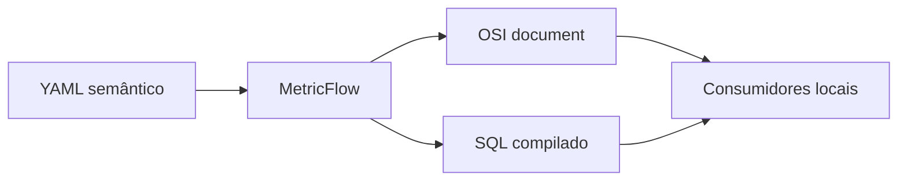

# Episódio 4 — Semântica aberta e interoperável

**Duração alvo:** 20–23 minutos
**Nível:** intermediário
**Rótulos na tela:** `OPEN`, `MetricFlow 0.212.0`, `OSI`, `API gerenciada: temporada 2`

## Gancho

“Métrica como código só é útil se não ficar presa num arquivo que ninguém consegue consumir. Hoje vamos sair do YAML para três interfaces abertas: consulta MetricFlow, SQL governado e o documento OSI produzido pelo Core.”

## Objetivo e pré-requisitos

Reconciliar uma definição semântica em interfaces locais e mostrar, sem simulação, onde termina o open source e começa a Semantic Layer gerenciada.

Pré-requisito: checkpoint 03 e as métricas `orders`, `gross_revenue`, `delivered_revenue` e `average_order_value` válidas.



*Diagrama conceitual autoral: duas interfaces abertas derivadas da mesma definição.*

## Roteiro falado

### 00:00–04:00 — Três interfaces, uma fonte de significado

“O YAML versionado declara entidades, dimensões e métricas. MetricFlow recebe uma consulta semântica e compila SQL. A fachada `semantic.commerce_orders` oferece uma tabela estável para ferramentas SQL. O Core 1.12 também gera `osi_document.json`, um documento que representa a semântica de forma interoperável.

Isso não cria uma API hospedada, cache distribuído ou conectores gerenciados. Esses recursos pertencem à segunda temporada. Aqui a pergunta é: consigo transportar a mesma intenção sem copiar a fórmula?”

**Visual:** `YAML -> MetricFlow / OSI / SQL governado`; caixa Platform fora do fluxo, marcada “depois”.

### 04:00–08:00 — Consulta MetricFlow

```bash
DBT_PROFILES_DIR=dbt_profiles mf query \
  --metrics orders,gross_revenue,delivered_revenue,average_order_value \
  --group-by metric_time__month \
  --order metric_time__month
```

“O consumidor escolhe métricas e dimensão temporal. Não escreve `sum(case when status = ...)`. Para abril, receita bruta é 210 e receita entregue também é 210. No total, receita bruta é 740 e entregue é 630.”

### 08:00–12:00 — SQL governado e export

“Nem toda ferramenta entende uma consulta semântica. Nesse caso, exponha uma view/tabela contratada ou um export com owner, SLA e lineage. O que não deve acontecer é a ferramenta copiar a regra.

A fachada `commerce_orders` usa o ponteiro `latest_version`, atualmente resolvido para a versão 2 da API. Uma consulta SQL local usa os mesmos campos que alimentam MetricFlow e o benchmark. Se precisarmos de uma API aberta, ela pode ser construída sobre essa interface; mas operação, autenticação e cache passam a ser nossa responsabilidade.”

### 12:00–15:30 — OSI sem promessa exagerada

“`osi_document.json` torna o significado legível por outra máquina. Interoperabilidade não significa que qualquer BI consome automaticamente o arquivo hoje. Significa que temos um contrato independente do SQL final e podemos testar sua presença, versioná-lo e avaliar consumidores compatíveis.”

```bash
python scripts/verify_artifacts.py
```

“O teste falha se o documento não existir ou estiver vazio. Essa é a evidência do laboratório; integração externa precisa de teste próprio.”

### 15:30–19:00 — Demonstração completa

```bash
python course.py checkpoint 04
```

“O checkpoint consulta MetricFlow, valida artifacts e executa dez perguntas diretamente em DuckDB. A aceitação não é um print bonito: é reconciliação com ground truth.”

**Resultado esperado:** meses de janeiro a abril; `Ground truth OK: 10 perguntas`; artifact OSI válido.

### 19:00–22:00 — Case e fechamento

“A Inventa reportou 83 métricas e 90% de redução na manutenção. Isso é resultado declarado pela empresa/dbt Labs, não expectativa do laboratório. O mecanismo aproveitável é centralização com ownership; o número depende do baseline e do processo.

No próximo episódio vamos tratar a interface Gold como API e provar uma quebra antes que ela chegue ao consumidor.”

## Contrato de consumo por canal

- MetricFlow: nome da métrica, dimensões/filtros permitidos e timezone.
- SQL/export: schema, versão, owner, SLA e política de atualização.
- Agente: descrição curta, métricas permitidas e comportamento diante de ambiguidade.
- OSI: versão do documento e compatibilidade do consumidor.

## Governança, FinOps e IA

- Governança: a fórmula continua versionada e todo export recebe owner.
- FinOps: reuso pode reduzir consultas duplicadas; meça execução/cache antes de afirmar economia.
- IA: nomes de métricas comprimem contexto e reduzem joins inventados.

## Limitações e anti-patterns

- Não chamar `osi_document.json` de conector universal.
- Não apresentar uma API local criada pela equipe como dbt Semantic Layer gerenciada.
- Não materializar export sem freshness e lineage.
- Não usar fixture de agente como resultado real.

## Radar — máximo de dois minutos

“O formato semântico e OSI continuam evoluindo. Core 2.0/Fusion podem ampliar validação e experiência de desenvolvimento, mas ficam fora da execução. APIs, cache e integrações gerenciadas serão testadas somente com trial na segunda temporada.”

## CTA

“Escolha uma métrica e prove o mesmo valor via MetricFlow e SQL. Se precisar copiar a fórmula, sua interface ainda não está centralizada.”

## Fontes

- [Especificação recente de métricas](https://docs.getdbt.com/docs/build/latest-metrics-spec)
- [MetricFlow](https://github.com/dbt-labs/metricflow)
- [OSI](https://github.com/open-semantic-interchange/OSI)
- [Case Inventa — resultado reportado](https://www.getdbt.com/case-studies/inventa)
- [Checkpoint executável](../lab/dabdbt/checkpoints/04-interfaces.md)

## Material complementar

- [Open Semantic Interchange](https://github.com/open-semantic-interchange/OSI) — OSI, repositório/EN; especificação aberta usada pelo artifact; episódio 4; verificado em 2026-09-01.
- [Como a Semantic Layer usa MetricFlow](https://www.getdbt.com/blog/how-the-dbt-semantic-layer-works) — dbt Labs, artigo/EN; fluxo técnico oficial; episódio 4; verificado em 2026-09-01.
