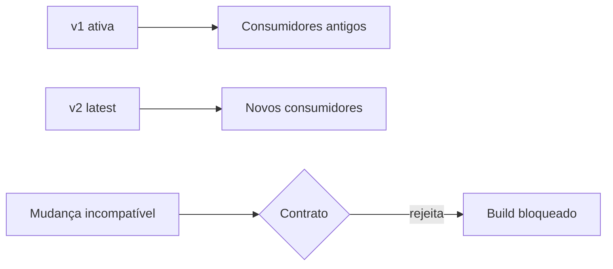

# Episódio 5 — Contratos e versões: tratando a Gold como API

**Duração alvo:** 20–23 minutos
**Nível:** intermediário
**Rótulos na tela:** `contrato ≠ data test`, `versão só para breaking change`, `depreciação: 2027-01-31 no lab`

## Gancho

“Renomear uma coluna Gold pode quebrar um dashboard às seis da manhã e um agente às seis da tarde. Se a Gold é consumida fora do seu time, ela já é uma API — só falta tratá-la como uma.”

## Objetivo e pré-requisitos

Adicionar contrato, constraints, versões, versão vigente e política de depreciação; demonstrar uma quebra bloqueada antes do consumidor.

Pré-requisito: modelo `commerce_orders` e checkpoint 04.



*Diagrama conceitual autoral: coexistência de versões e bloqueio estrutural.*

## Roteiro falado

### 00:00–03:00 — O contrato possível no dbt

“No dbt, model contract declara nomes e tipos esperados. Com `enforced: true`, o build verifica se o SQL produz essa forma. Dependendo de materialização e adaptador, algumas constraints também podem ser aplicadas no warehouse.

Isso não prova que os dados estão corretos. Uma coluna `total_payment decimal` pode conter um valor comercialmente errado e ainda cumprir o contrato. Estrutura é contrato; qualidade é testada por outras camadas.”

```yaml
config:
  contract:
    enforced: true
columns:
  - name: order_id
    data_type: varchar
  - name: total_payment
    data_type: decimal(18,2)
```

### 03:00–07:00 — Qual modelo merece contrato

“Aplique contrato no limite público: modelo que alimenta dashboard crítico, API, outro time ou agente. Não comece contratando cada staging instável. A própria documentação alerta que governança adotada cedo demais aumenta manutenção e dificulta rollback.

No laboratório, `order_metrics` pertence ao grupo comércio, tem acesso público e contrato. Modelos Silver continuam internos e evoluem com mais liberdade.”

**Visual:** castelo: modelos privados dentro; portão público com contrato.

### 07:00–11:30 — Quando criar uma versão

“Versão é para mudança incompatível: remover ou renomear coluna, mudar tipo ou alterar de forma intencional uma garantia. Adicionar coluna costuma ser compatível. Corrigir bug geralmente não pede versão, embora uma mudança semântica grande exija julgamento e comunicação.

O laboratório tem `order_metrics_v1` e `order_metrics_v2`. A v2 adiciona receita entregue e receita de itens, e vira `latest_version`. A v1 recebe data de depreciação. Durante a janela, um consumidor pode referenciar explicitamente v1 enquanto migra.

Manter duas versões custa storage, compute, testes e suporte. `deprecation_date` precisa ser acompanhada por inventário de consumidores e remoção planejada; caso contrário vira cemitério de APIs.”

### 11:30–16:30 — Demonstração do breaking change

“Primeiro mostro o build saudável. Depois o script de prova copia o projeto para uma pasta temporária, remove `customer_id` do SQL da versão 2 e executa somente esse modelo. A árvore original permanece intacta.”

```bash
python course.py checkpoint 05
```

“O resultado esperado é: `Breaking change bloqueada: implementação sem customer_id viola o contrato da versão 2.` O valor pedagógico está no exit code. Uma CI pode impedir o merge sem esperar o dashboard falhar.”

“Agora abra `schema.yml`: `latest_version: 2`, versões 1 e 2, colunas com tipo, `access: public`, `group: commerce` e data de depreciação da v1. Abra `commerce_orders.sql`: a fachada usa `ref('order_metrics')`, e o manifest comprova que o ponteiro resolveu a versão 2.”

**Visual:** animação `PR remove coluna -> contract check vermelho -> consumidor permanece verde`.

### 16:30–19:30 — Mudança estrutural e mudança semântica

“Contratos detectam forma. Eles não percebem que alguém alterou `delivered_revenue` para incluir pedidos enviados mantendo nome e tipo. Para isso precisamos de unit tests, data tests e ground truth. A API de dados tem dois contratos: o estrutural, legível pela máquina, e o comportamental, expresso em exemplos e testes.

Para agentes, estabilidade estrutural reduz falha de tool call. Estabilidade semântica reduz resposta incorreta silenciosa. As duas importam.”

### 19:30–22:00 — Caso e fechamento

“No projeto privado, contratos enforced já existem em algumas Gold, enquanto versionamento aparece em documentação, não nos YAML executáveis auditados. A evolução correta é preservar o que funciona e adicionar coexistência/depreciação onde há consumidores reais.

No laboratório, uma remoção de coluna é bloqueada antes da materialização. Não atribuímos porcentagem; comprovamos a propriedade executável. Em organizações maiores, o valor aparece como menos incidentes e migrações planejadas, mas precisa ser medido.

No próximo episódio vamos construir a pirâmide que cobre aquilo que contrato não cobre.”

### Inserção obrigatória — Política de depreciação em prática

“Uma versão sem política de saída vira dívida permanente. Para cada versão antiga, registre quatro datas: publicação da sucessora, aviso aos consumidores, fim do suporte e remoção. Registre também o owner e as exposures que ainda dependem dela.

Vamos imaginar que um dashboard referencia v1 explicitamente. Ao publicar v2, o produtor envia um changelog com colunas adicionadas, diferenças semânticas e uma query de comparação. Durante a janela, a CI constrói as duas. Uma semana antes da remoção, `dbt ls` e o catálogo procuram dependências; o owner confirma a migração. Só então v1 sai.

E se o consumidor não migrar? A resposta não é manter para sempre por padrão. O fórum de governança decide entre estender a data, aceitar quebra ou oferecer uma fachada compatível. Essa decisão tem custo visível: compute duplicado e tempo de suporte.

Também separo três mudanças na tela. Adicionar `item_revenue` é compatível para quem ignora a coluna. Remover `customer_id` é breaking e pede nova versão. Corrigir o sinal de `delivery_days` mantém schema, mas altera valores: é correção comportamental, protegida por teste e comunicada no changelog, não necessariamente nova versão. Essa classificação evita transformar versionamento em reflexo automático.”

## Resultado esperado

- Checkpoint 05 retorna sucesso porque a alteração incompatível é rejeitada.
- O script usa diretório temporário e não modifica o checkout.
- v1 continua referenciável e tem data de depreciação; v2 é vigente.

## Governança, FinOps e IA

- Governança: interface, owner, versão e janela de migração explícitos.
- FinOps: falhar antes do warehouse/consumidor reduz retrabalho; manter versões tem custo.
- IA: schemas previsíveis reduzem tools quebradas; testes comportamentais protegem significado.

## Limitações e anti-patterns

- Constraints físicas variam por plataforma e materialização.
- Não versionar toda adição de coluna ou correção pequena.
- Não manter versão sem owner, consumidor conhecido e data de saída.
- Contrato não detecta toda mudança lógica.

## Radar — máximo de dois minutos

“O Core 1.12 usa `latest_version` como ponteiro da versão padrão. Melhorias futuras de validação serão avaliadas separadamente; não existe motivo para migrar um contrato estável para runtime beta apenas para seguir novidade.”

## CTA

“Escolha um modelo público, liste seus consumidores e simule a remoção de uma coluna numa branch. Se nada bloquear, você encontrou um risco real para levar à próxima retrospectiva.”

## Fontes

- [Model contracts](https://docs.getdbt.com/docs/mesh/govern/model-contracts)
- [Model versions](https://docs.getdbt.com/docs/mesh/govern/model-versions)
- [Auditoria anonimizada do projeto](../pesquisa/auditoria-projeto-privado.md)
- [Checkpoint executável](../lab/dabdbt/checkpoints/05-contratos-versoes.md)

## Material complementar

- [Model governance](https://docs.getdbt.com/docs/mesh/govern/about-model-governance) — dbt Labs, documentação/EN; conecta contratos, acesso e versões; episódio 5; verificado em 2026-09-01.
