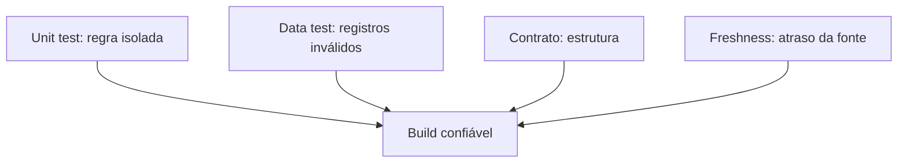

# Episódio 6 — A pirâmide moderna de qualidade de dados

**Duração alvo:** 20–23 minutos
**Nível:** intermediário
**Rótulos na tela:** `unit`, `contract`, `data test`, `freshness`, `observabilidade`

## Gancho

“Um teste `not_null` pode passar enquanto sua regra de prazo devolve menos cinco dias. E um unit test perfeito pode passar enquanto a fonte não atualiza há três dias. Qualidade de dados não é um comando: é uma pirâmide de perguntas diferentes.”

## Objetivo e pré-requisitos

Separar e combinar unit tests, data tests, contratos, freshness e observabilidade; proteger uma regra funcional e explicar quando cada falha ocorre.

Pré-requisito: checkpoint 05 e build local disponível.



*Diagrama conceitual autoral: cada teste responde a uma pergunta diferente.*

## Roteiro falado

### 00:00–04:00 — Cinco perguntas, cinco mecanismos

“Unit test pergunta: com estas entradas pequenas, a lógica SQL produz estas saídas? Contrato pergunta: o modelo produz as colunas e tipos prometidos? Data test pergunta: os dados materializados respeitam uma propriedade? Freshness pergunta: a fonte chegou no prazo? Observabilidade pergunta: o comportamento ao longo do tempo — volume, duração, distribuição e dependências — está saudável?

Se usamos apenas `not_null`, respondemos só uma fração. A pirâmide não indica que um mecanismo é melhor; indica que testes baratos e específicos devem vir antes de verificações amplas e operacionais.”

**Visual:** pirâmide da base para o topo: compilação/contrato, unit, data, freshness, observabilidade/SLO.

### 04:00–08:00 — Unit test do bug de data

“O modelo original tinha risco de inverter os argumentos de `datediff`. Criamos uma entrada estática: compra em 1º de janeiro e entrega em 5 de janeiro. A saída esperada é quatro dias positivos.

O unit test não precisa carregar toda a tabela. Ele fornece `orders_s` e `order_payments_s` falsos e verifica as colunas relevantes. É exatamente o tipo de lógica recomendado para unit test: matemática de datas e regressão de um bug conhecido.”

```yaml
unit_tests:
  - name: order_fulfillment_uses_positive_delivery_interval
    model: order_fulfillment_g
    given: ...
    expect:
      rows:
        - {order_id: test_order, delivery_days: 4}
```

“Unit test deve rodar em desenvolvimento e CI. Executá-lo em toda carga de produção gasta compute sem acrescentar informação, pois as entradas são estáticas.”

### 08:00–12:00 — Data tests e regras materializadas

“Depois do build, verificamos chaves não nulas e únicas, relacionamentos de pedidos, valores aceitos de status e chave composta de itens. Um teste singular garante que receita entregue nunca seja negativa nem maior que o pagamento total.

Observe a diferença: o unit test prova um exemplo construído; o data test procura violações na população atual. Um pode passar e o outro falhar.”

```sql
select *
from {{ ref('order_metrics', v=2) }}
where delivered_revenue > total_payment
   or delivered_revenue < 0
```

### 12:00–15:00 — Freshness e observabilidade

“A fonte `lab_quality.load_audit` declara `loaded_at_field`. O checkpoint cria a tabela com `current_timestamp`, executa freshness e espera `pass`. Depois envelhece a mesma carga em 24 horas, espera `error` e restaura a fonte recente. Assim o teste não depende do ano do dataset Olist.

Freshness ainda não detecta queda de volume, mudança de distribuição ou pipeline que concluiu verde com metade dos registros. Essas necessidades entram em observabilidade. Pode ser solução comercial ou stack aberta; o princípio é guardar histórico, SLO, contexto de incidente e ownership.”

### 15:00–18:30 — Demonstração

```bash
python course.py checkpoint 06
```

“O `dbt build` ordena dependências, executa unit test, materializa e roda data tests. Na versão validada, são 45 recursos aprovados e uma exposure `NO-OP`. Para isolar unit tests:”

```bash
dbt test --profiles-dir dbt_profiles --target local \
  --select "test_type:unit"
```

“Para inspecionar o resultado, abra `target/run_results.json`. Não dependa apenas do texto verde no terminal: a CI e a observabilidade devem armazenar artifacts.”

“Agora execute o teste positivo e o negativo de freshness:”

```bash
python scripts/verify_source_freshness.py
```

**Resultado esperado:** unit test do intervalo passa; 25 data tests passam; contratos dos modelos versionados passam; zero warning de depreciação.

### 18:30–21:30 — Caso e decisão de investimento

“O mini-case é o bug real encontrado na auditoria: um cálculo sintaticamente válido com sinal incorreto. `not_null` e `unique` não o encontrariam. Um único caso estático tornou a regressão determinística.

A ordem de investimento é: proteja regra crítica já conhecida; adicione contratos nas interfaces; teste propriedades do dado; monitore freshness; depois compre ou opere observabilidade de acordo com SLO e escala. Comprar plataforma antes de definir owner e resposta ao alerta produz apenas mais notificações.”

### 21:30–23:00 — Fechamento

“Qualidade madura não é ter muitos testes; é cada risco ter o mecanismo adequado e um responsável. No próximo episódio vamos colocar esse responsável e os consumidores dentro do próprio grafo.”

### Inserção obrigatória — Matriz de falhas

“Vou fechar a demonstração provocando quatro falhas em exemplos de tela. Se retiro uma coluna contratada, falha contrato. Se inverto `datediff`, falha unit test. Se insiro status desconhecido no seed, falha `accepted_values`. Se congelo a fonte além do SLA, falha freshness. O mesmo sintoma — dado errado no dashboard — tem diagnósticos e momentos de detecção diferentes.

Para cada teste, escreva ao lado: risco coberto, severidade, owner e resposta. Um `not_null` em coluna opcional não deve bloquear produção. Uma divergência de receita reconhecida talvez deva. A severidade nasce do impacto, não do tipo de macro.

Também contabilize custo de qualidade. Testes de relacionamento em tabelas enormes podem fazer scans caros. Estratégias incluem testar partições recentes, executar validações pesadas em frequência menor e usar unit tests para lógica estática. Otimizar teste não significa reduzir cobertura às cegas; significa colocar cada controle na etapa mais barata que ainda detecta o risco.

Por fim, mostro o runbook: alerta identifica teste e modelo; manifest encontra owner e exposure; logs apontam amostra de falhas; o time decide rollback, correção ou exceção temporária. Sem esse caminho, uma pirâmide de testes vira uma pirâmide de alertas ignorados.”

## Governança, FinOps e IA

- Governança: cada regra crítica tem teste e owner; artifacts registram evidência.
- FinOps: unit tests em CI evitam cargas desnecessárias; excesso de testes redundantes também custa.
- IA: agente consome interfaces testadas e pode consultar estado/freshness, mas não deve ignorar alertas.

## Limitações e anti-patterns

- Unit tests do dbt são para modelos SQL e têm caveats por adaptador.
- Freshness baseada na data de negócio pode não representar horário real de ingestão.
- Teste sem severidade, owner e resposta operacional vira ruído.
- Não usar fixture histórica para definir SLA de produção.

## Radar — máximo de dois minutos

“Novas engines podem antecipar erros de parse e coluna, mas não substituem unit, data, freshness e observabilidade. O Radar acompanha melhorias futuras; a pirâmide demonstrada permanece toda no Core 1.12.”

## CTA

“Pegue uma regra com `case`, data ou janela e escreva o menor unit test que reproduz um bug possível. Depois adicione um data test que procure a mesma violação nos dados reais.”

## Fontes

- [Unit tests no dbt](https://docs.getdbt.com/docs/build/unit-tests)
- [Model contracts](https://docs.getdbt.com/docs/mesh/govern/model-contracts)
- [Source freshness](https://docs.getdbt.com/docs/build/sources#source-data-freshness)
- [Checkpoint executável](../lab/dabdbt/checkpoints/06-qualidade.md)

## Material complementar

- [Curso Advanced Testing](https://learn.getdbt.com/catalog?category=courses) — dbt Labs, curso/EN; prática oficial complementar; episódio 6; verificado em 2026-09-01.
- [Data tests](https://docs.getdbt.com/docs/build/data-tests) — dbt Labs, documentação/EN; referência oficial de assertions; episódio 6; verificado em 2026-09-01.
