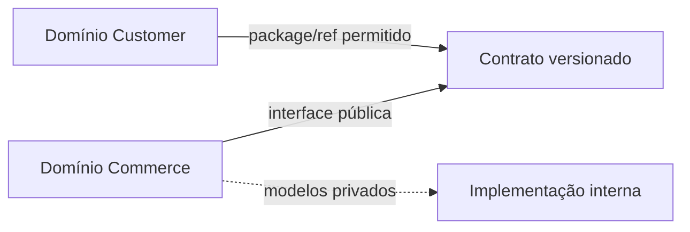

# Episódio 8 — Data products sem depender de Mesh

**Duração alvo:** 19–22 minutos
**Nível:** intermediário/avançado
**Rótulos na tela:** `OPEN`, `um projeto`, `packages`, `Mesh: temporada 2`

## Gancho

“O projeto real que auditamos já tem dez projetos dbt e um template. Isso significa que ele tem data mesh? Não necessariamente. Hoje vamos construir o que torna um produto de dados real — consumidor, owner, interface e contrato — usando apenas Core e um projeto.”

## Objetivo e pré-requisitos

Definir produto, interface pública e dependência privada; aplicar limites dentro de um projeto; explicar packages como próximo passo aberto. Cross-project refs e experiência Mesh ficam fora da demonstração.

Pré-requisito: checkpoint 07 com grupo, access, owner e exposure válidos.



*Diagrama conceitual autoral: produto de dados começa pela fronteira pública.*

## Roteiro falado

### 00:00–04:00 — Produto não é pasta Gold

“Um data product precisa responder: quem consome, quem responde, qual interface, quais garantias e como a mudança é comunicada? Uma pasta `gold` sem isso é um conjunto de tabelas.

No laboratório, comércio publica `commerce_orders`, `order_metrics` e métricas nomeadas. Seeds, Silver, detalhes de pagamento e regras intermediárias continuam implementação.”

### 04:00–08:00 — A lição do projeto privado

“A topologia real já separa domínios, deploys e catálogos. Em alguns projetos há `private`, `protected` e `public`; em outros, o padrão ainda não é uniforme. Isso cria um episódio melhor que um exemplo inventado: antes de adicionar outra plataforma, precisamos padronizar a fronteira que o manifest consegue verificar.

Também encontramos faixas de adapter diferentes. Cada projeto independente ganha autonomia, mas também ganha atualização, lock, artifact e incidente próprios. Autonomia tem custo operacional.”

**Visual:** portfólio anonimizado com dez caixas; sem nomes reais.

### 08:00–12:00 — Limites abertos no Core

```bash
dbt ls --profiles-dir dbt_profiles --target local --select group:commerce
dbt ls --profiles-dir dbt_profiles --target local --select access:public
```

“`group` declara responsabilidade. `access` restringe dependências. Contrato e versão tornam a interface previsível. Exposure documenta consumidor. Tags e `meta` ligam classificação e operação.

Se outro repositório precisa reutilizar macros ou uma camada estável, packages Git são um próximo passo aberto. O package deve fixar versão e declarar compatibilidade; apontar para `main` recria dependência invisível.”

### 12:00–16:00 — Quando separar fisicamente

“Separe quando owners, permissões, cadências e releases são de fato independentes; quando o DAG e os conflitos justificam a coordenação extra. Não separe porque o organograma tem dez áreas.

Um domínio de logística deve depender da interface pública de fulfillment, não de `orders_s`. Se a implementação de pagamentos muda e o contrato é preservado, logística não muda. Se há breaking change, comércio publica uma nova versão e usa exposures para localizar consumidores.”

### 16:00–19:00 — Demonstração

```bash
python course.py checkpoint 08
```

“O script valida grupo, acesso público, contrato, versões, tags, consumidores aprovados e exposure. O resultado esperado é `Governança OK`. Nada faz chamada cross-project ou usa conta dbt.”

```text
commerce
├── implementação: seeds, Silver e modelos Gold internos
├── interface: order_metrics.v1/v2 + commerce_orders
└── consumidores: BI, API local e agente somente leitura
```

### 19:00–21:30 — Fechamento

“Este laboratório escolhe conscientemente não usar Mesh físico. A equipe aprende produto e interface primeiro. Na segunda temporada, com acesso apropriado, vamos comparar esse baseline com cross-project refs e catálogo gerenciado.”

## Critério de adoção

Use um score de cinco sinais: owner separado, permissão separada, release independente, conflitos frequentes e DAG grande. Um único sinal raramente justifica a divisão; vários sinais persistentes justificam um piloto.

## Governança, FinOps e IA

- Governança: dependência apenas por interface pública e owner identificável.
- FinOps: projetos separados facilitam rateio, mas podem duplicar jobs e compute.
- IA: catálogo de produtos reduz descoberta irrestrita e superfície de dados.

## Limitações e anti-patterns

- Não chamar toda Gold de produto.
- Não publicar todas as tabelas para “facilitar”.
- Não apontar package para branch mutável em produção.
- Não afirmar que o laboratório demonstrou Mesh cross-project.

## Radar — máximo de dois minutos

“dbt Mesh e cross-project refs entram na segunda temporada, rotulados pelo plano e maturidade atuais. O radar também acompanhará dependências semânticas cross-project no formato novo. Nada disso é requisito para aplicar owner, access, contrato e versão hoje.”

## CTA

“Desenhe a borda de um domínio seu. Se quase tudo virou público, a interface ainda está grande demais.”

## Fontes

- [Add groups to your DAG](https://docs.getdbt.com/docs/build/groups)
- [Model access](https://docs.getdbt.com/docs/mesh/govern/model-access)
- [Packages](https://docs.getdbt.com/docs/build/packages)
- [Auditoria anonimizada](../pesquisa/auditoria-projeto-privado.md)
- [Checkpoint executável](../lab/dabdbt/checkpoints/08-data-products-open.md)

## Material complementar

- [Estrutura recomendada de projetos](https://docs.getdbt.com/best-practices/how-we-structure/1-guide-overview) — dbt Labs, documentação/EN; separação de responsabilidades; episódio 8; verificado em 2026-09-01.
