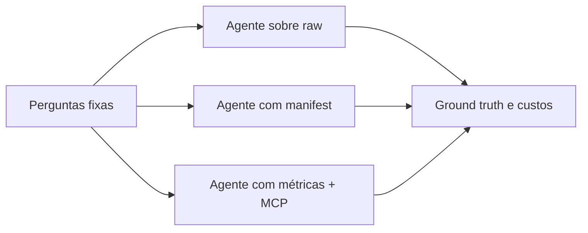

# Episódio 12 — Gold governada versus agente solto

**Duração alvo:** 23–25 minutos
**Nível:** avançado
**Rótulos na tela:** `fixture sintética ≠ benchmark real`, `ground truth determinístico`, `agente consome regras`

## Gancho

“O melhor agente é o que raciocina mais ou o que precisa adivinhar menos? Vamos comparar schema bruto, manifest documentado e métricas via MCP — medindo resposta, join, tokens, ferramentas, latência e custo.”

## Objetivo e pré-requisitos

Definir um benchmark justo de três abordagens, validar traces sem chave de LLM e fechar com arquitetura em que o pipeline detém regras funcionais e o agente as consome.

Pré-requisito: checkpoints 01–11 e banco local construído.



*Diagrama conceitual autoral: os três modos enfrentam as mesmas perguntas e critérios.*

## Roteiro falado

### 00:00–04:00 — A hipótese e os três tratamentos

“A hipótese é: quanto mais governada e compacta a interface, maior a aderência às regras e menor o trabalho do agente. Para testá-la, mantemos perguntas, modelo, parâmetros, pricing e dataset constantes. Variamos apenas o contexto e as ferramentas.

Modo A: agente sobre schema bruto. Ele vê tabelas de pedidos, itens e pagamentos. Modo B: recebe manifest, documentação e linhagem. Modo C: recebe métricas e MCP somente leitura.

Não compare modelos diferentes e chame isso de efeito da semantic layer. Não altere prompts entre rodadas sem registrar. E execute várias repetições porque LLM é probabilístico.”

**Visual:** experimento A/B/C com tudo fixo exceto interface.

### 04:00–08:00 — Ground truth antes do agente

“O arquivo `benchmarks/questions.json` contém dez perguntas, SQL aprovado, regra e resposta esperada. Exemplos: 8 pedidos; receita bruta 740; receita entregue 630; ticket médio 92,50; prazo médio 5 dias; abril 210; e 110 de pagamento ainda não reconhecido como receita entregue.

Esses valores são calculados pela fachada `semantic.commerce_orders`. Antes de chamar qualquer modelo, executamos todas as queries no DuckDB. Se o ground truth não é determinístico, a avaliação do agente não é confiável.”

```bash
python scripts/verify_ground_truth.py
```

### 08:00–12:30 — O contrato do trace

“Cada trace informa `run_id`, modo, se é fixture, modelo e preços normalizados. Cada pergunta grava resposta, SQL, tokens de entrada e saída, tool calls, latência e flag de join inválido. O avaliador combina isso com `questions.json` e gera `target/agent_benchmark_report.json`, onde cada registro contém pergunta, resposta esperada, SQL, resultado e custo normalizado.

O custo normalizado é calculado com uma tabela de preços registrada no trace, não buscada depois. Para modelos locais, preço pode ser zero, mas registre tempo e hardware separadamente. O schema JSON impede que uma rodada sem latência ou SQL seja aceita silenciosamente.”

```json
{
  "question_id": "q03",
  "answer": 630,
  "sql": "...",
  "tokens_input": 320,
  "tokens_output": 42,
  "tool_calls": 1,
  "latency_ms": 610,
  "invalid_join": false
}
```

### 12:30–16:00 — Fixtures versus execução real

“O repositório inclui três arquivos `*.fixture.json`. Eles foram inventados para testar o avaliador em CI. Um marca 50% de acurácia, outro 90% e outro 100%. Esses percentuais não vieram de ChatGPT, Claude, Gemini nem outro LLM. Nunca devem ser usados como thumbnail, gráfico de resultado ou argumento de venda.

A utilidade das fixtures é determinística: se alguém quebrar o cálculo de custo ou o schema, a CI detecta sem chave de API. A execução real vem depois, gravando `fixture: false` e identificando modelo, versão, prompt e data.”

**Visual obrigatório:** tarja grande “DADOS SINTÉTICOS PARA TESTAR O AVALIADOR”.

### 16:00–19:00 — Demonstração do checkpoint final

```bash
python course.py checkpoint 12
```

“O primeiro passo recalcula as dez respostas. O segundo valida cada trace contra `benchmark.schema.json` e produz resumo de acurácia, joins inválidos, tokens, tools, latência e custo normalizado.

O relatório combinado também é validado por `benchmark-report.schema.json`. Assim um consumidor não precisa fazer join implícito entre trace e ground truth para auditar uma linha.

O aceite do checkpoint é o avaliador funcionar e todas as perguntas estarem presentes. Não é provar que o modo C sempre vence. Essa conclusão só pode vir de traces reais, repetidos e controlados.”

### 19:00–22:00 — O que os cases sugerem

“A Bilt descreve uma camada conversacional conectada a LLMs e reporta redução de custo em sua plataforma analítica. A impact.com apresenta a Semantic Layer como interface para agentes. Uma entrevista com a Ramp relata que chamadas MCP diretas ao Gong consumiam de dez a cinquenta mil tokens e que uma camada semântica reduziu o payload em cerca de vinte vezes.

Todos são relatos publicados no ecossistema dbt, não ensaios independentes. Eles justificam a hipótese e as métricas — especialmente tokens e tool calls —, mas não antecipam o resultado do nosso ambiente.”

### 22:00–24:30 — Arquitetura recomendada

“A arquitetura final tem cinco limites.

Um: fontes entram por pipeline observado. Dois: Silver padroniza. Três: Gold calcula regras determinísticas como reconhecimento de receita e prazo. Quatro: contrato, versão, métricas, owner e classificação expõem uma interface mínima. Cinco: agente acessa essa interface por ferramentas somente leitura, com IAM, orçamento e logs.

O agente continua útil para interpretar a pergunta, escolher métrica, aplicar filtro, explicar resultado e lidar com ambiguidade. Ele não inventa a fórmula de receita nem escolhe um join não aprovado.

Se uma regra muda, alteramos código, testes, versão e documentação. Depois o agente recebe a nova interface. Isso torna o comportamento auditável e reduz a dependência de prompt engineering.”

**Visual final:** arquitetura em camadas; escudo em contrato/semântica; agente na extremidade como consumidor.

### 24:30–25:00 — Encerramento

“A temporada começou perguntando o que existe além de modelos, testes e linhagem. A resposta é tratar dados transformados como produto: significado, contrato, owner, custo e acesso. Rode os doze checkpoints e, quando fizer a execução real do benchmark, publique também as derrotas. Elas ensinam onde a interface ainda está ambígua.”

## Protocolo para execução real posterior

1. Fixar dataset, snapshot, dez perguntas e ground truth.
2. Fixar modelo, versão, temperatura, limite de tokens e prompt base.
3. Definir exatamente o contexto de A, B e C.
4. Usar identidade read-only e budget de consultas.
5. Executar no mínimo várias repetições por modo e guardar traces brutos.
6. Fazer revisão cega de resposta e SQL; classificar joins inválidos.
7. Reportar média, dispersão, falhas, tokens, tools, latência, custo LLM e custo de warehouse.
8. Não misturar fixtures com resultados reais.

## Resultado esperado

- `Ground truth OK: 10 perguntas validadas no DuckDB`.
- Três fixtures aceitas pelo schema, cada uma com exatamente as dez perguntas.
- Resumo calcula acurácia, joins inválidos, tokens, tool calls, latência e custo normalizado.
- Nenhuma conclusão sobre superioridade de um LLM é publicada antes de traces reais com `fixture: false`.

## Governança, FinOps e IA

- Governança: ground truth, interface versionada, privilégio mínimo e trilha de auditoria.
- FinOps: custo total inclui LLM, warehouse, latência, retries e operação da camada.
- IA: medir aderência às regras e não apenas semelhança textual da resposta.

## Limitações e anti-patterns

- Dez perguntas não cobrem todo o domínio.
- Ground truth pode conter a mesma suposição errada que o pipeline; exige revisão de negócio.
- Latência varia por rede, cache e provedor.
- Não transformar relato de fornecedor ou fixture em causalidade universal.

## Radar — máximo de dois minutos

“Quando houver acesso ao trial, o mesmo protocolo poderá trocar o contexto local pela Semantic Layer e Discovery gerenciados. A pergunta, ground truth e schema permanecem fixos. O Radar não publica comparação até existirem traces reais, repetidos e marcados `fixture: false`.”

## CTA

“Faça uma rodada real com `fixture: false`, publique modelo, prompt, data e traces anonimizados. A comunidade consegue avaliar uma metodologia transparente; não consegue auditar um gráfico sem protocolo.”

## Fontes

- [dbt MCP](https://docs.getdbt.com/docs/dbt-ai/about-mcp)
- [Case Bilt Rewards — resultado reportado](https://www.getdbt.com/case-studies/bilt-rewards)
- [Sessão Bilt sobre camada conversacional](https://www.getdbt.com/resources/coalesce-on-demand/coalesce-2025-bilts-conversational-data-layer-how-they-connected-data-to-llms-with-dbt)
- [Case impact.com — resultado reportado](https://www.getdbt.com/case-studies/impact.com)
- [Entrevista Ramp — relato/anecdota](https://roundup.getdbt.com/p/the-scarce-resource-is-consensus)
- [Checkpoint executável](../lab/dabdbt/checkpoints/12-agentes.md)

## Material complementar

- [MCP: IA confiável com contexto dbt](https://www.getdbt.com/blog/dbt-mcp-server-reliable-ai) — dbt Labs, artigo/EN; case M1 Finance reportado pelo fornecedor; episódio 12; verificado em 2026-09-01.
