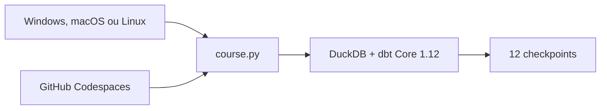

# Aula 0 — Prepare seu laboratório dbt sem sofrer com o ambiente

**Duração alvo:** 18–22 minutos  
**Nível:** iniciante  
**Rótulos na tela:** `OPEN`, `Windows`, `macOS`, `Linux`, `Codespaces`, `sem cloud`

## Gancho

“Antes de falar de modelo, métrica ou agente, precisamos garantir uma coisa: seu ambiente precisa funcionar sem você decorar caminhos diferentes ou ativar ferramentas escondidas.”

## Objetivo e pré-requisitos

Validar o computador, preparar o laboratório isolado e executar o checkpoint 01. O aluno precisa apenas reconhecer SQL básico e ter acesso a um terminal ou GitHub Codespaces.

## Roteiro falado

### 00:00–02:00 — O resultado antes das ferramentas

“Ao final desta aula você terá um banco DuckDB local, um projeto dbt compilado, testes executados e artifacts que poderá abrir. Nenhuma conta cloud e nenhuma chave de IA.”

### 02:00–04:00 — O que você precisa saber

“SQL básico é suficiente. Vamos ensinar os comandos de terminal, a função do Git, por que existe um ambiente Python e o que cada comando dbt produz.”

### 04:00–06:00 — Local ou Codespaces

“Local funciona sem custo recorrente e continua disponível offline após a instalação. Codespaces elimina boa parte da configuração, mas depende da conta e dos limites do GitHub. O laboratório e os comandos são os mesmos.”



### 06:00–09:00 — Diagnóstico antes da instalação

Execute na raiz:

```bash
python course.py doctor
```

“O diagnóstico não instala nada. Ele verifica Python 3.12/3.13, Git, espaço e permissão. No Windows podemos usar `py -3.12`; em macOS e Linux, `python3.12`.”

### 09:00–12:00 — Um setup, sem ativação manual

```bash
python course.py setup
```

“O curso cria `.venv`, instala versões fixadas, baixa packages dbt e executa `dbt debug`. Não precisamos ativar o ambiente manualmente nem ensinar comandos diferentes para PowerShell.”

### 12:00–15:30 — Primeiro checkpoint

```bash
python course.py checkpoint 01
```

“O checkpoint carrega a amostra, faz parse, build, gera documentação e verifica os artifacts. Procure `Checkpoint 01 OK`. Aviso amarelo deve ser lido; erro vermelho precisa ser resolvido.”

### 15:30–18:00 — Como pedir ajuda sem expor segredo

```bash
python course.py support-report
```

“Esse relatório mostra apenas sistema, versões e verificações. Ele não coleta variáveis de ambiente, tokens ou caminhos pessoais. Anexe o JSON ao modelo de issue.”

### 18:00–20:00 — Fechamento

“Você não precisa compreender toda a saída ainda. Precisa apenas saber repetir o ambiente e reconhecer onde está o resultado. No episódio 1 vamos dar significado a cada etapa.”

## Demonstração e resultado esperado

- `doctor` termina com “Pronto para o setup”.
- `setup` termina com “Ambiente pronto”.
- `checkpoint 01` termina com `Checkpoint 01 OK`.
- `build/support-report.json` não contém usuário, e-mail, host ou variável de ambiente.

## Sugestões visuais

- Tela dividida com Windows, macOS/Linux e Codespaces convergindo para o mesmo launcher.
- Destaque grande para o primeiro erro acionável do `doctor`.
- Linha do tempo curta: download inicial → trabalho local → ajuda.

## Limitações

- A primeira instalação precisa de internet para PyPI e GitHub.
- Codespaces segue franquias e cobrança da conta GitHub.
- A meta de 2 CPUs, 4 GB e 2 GB livres só vira mínimo validado após teste controlado.

## CTA

“Execute o diagnóstico agora. Se algum item falhar, abra o guia do seu sistema antes de avançar.”

## Fontes

- [Manual de instalação do dbt Core](https://docs.getdbt.com/guides/manual-install?step=1)
- [Criar um Codespace](https://docs.github.com/en/codespaces/developing-in-a-codespace/creating-a-codespace-for-a-repository)
- [Jaffle Shop com DuckDB](https://github.com/dbt-labs/jaffle_shop_duckdb)
- [Guia do aluno](../docs/README.md)

## Material complementar

- [dbt Learn](https://www.getdbt.com/dbt-learn) — dbt Labs, cursos/EN; referência oficial para continuar após o setup; Aula 0; verificado em 2026-09-01.
- [Documentação estável do DuckDB](https://duckdb.org/docs/stable/) — DuckDB, documentação/EN; referência do banco local; Aula 0; verificado em 2026-09-01.
