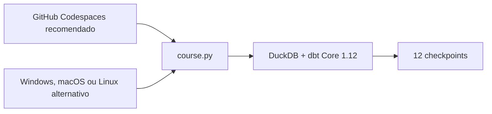

# Aula 0 — Prepare seu laboratório dbt sem sofrer com o ambiente

**Duração alvo:** 20–24 minutos
**Nível:** iniciante  
**Rótulos na tela:** `OPEN`, `Windows`, `macOS`, `Linux`, `Codespaces`, `sem cloud`

## Gancho

“Antes de falar de modelo, métrica ou agente, precisamos garantir uma coisa: todo mundo precisa começar do mesmo ambiente. Por isso, o Codespaces será nossa rota recomendada; a instalação local continua disponível.”

## Objetivo e pré-requisitos

Criar um Codespace de 2 núcleos, validar o laboratório preparado automaticamente e executar o checkpoint 01. O aluno precisa apenas reconhecer SQL básico, ter uma conta pessoal GitHub e acesso ao navegador. A instalação local é uma alternativa.

## Roteiro falado

### 00:00–02:00 — O resultado antes das ferramentas

“Ao final desta aula você terá um banco DuckDB local, um projeto dbt compilado, testes executados e artifacts que poderá abrir. Nenhuma conta cloud e nenhuma chave de IA.”

### 02:00–03:30 — O que você precisa saber

“SQL básico é suficiente. Vamos ensinar os comandos de terminal, a função do Git, por que existe um ambiente Python e o que cada comando dbt produz.”

### 03:30–07:00 — Codespaces como caminho recomendado

“Abra o repositório, clique em Code, Codespaces e Create codespace on main. Na configuração avançada, mantenha branch main, o dev container dbt Moderno na Prática e a máquina de 2 núcleos. Assim todos recebem Python 3.12, as mesmas extensões e as mesmas dependências.”

Mostrar as capturas `01-code-codespaces.png` e `02-configuracao-2-core.png` sem simular a interface.

### 07:00–09:00 — O que significa gratuito

“Em 1º de setembro de 2026, a conta pessoal GitHub Free inclui 120 core-hours e 15 GB-mês. Como usamos 2 núcleos, isso representa aproximadamente 60 horas ativas no ciclo. O limite não é infinito: pare o ambiente ao terminar e acompanhe o consumo. Sem forma de pagamento válida, o GitHub bloqueia o uso ao acabar a franquia.”

### 09:00–11:00 — Preparação automática e caminhos persistentes

“O arquivo `.devcontainer/devcontainer.json` é parte do curso. Na primeira criação, `postCreateCommand` executa o setup. A cada abertura, `postStartCommand` executa o diagnóstico, restaura o PATH do ambiente isolado e registra os caminhos efetivos. Nenhuma ativação manual de virtualenv é necessária.”



### 11:00–12:00 — Onde estão dbt, DuckDB e os artifacts

```bash
python course.py paths
```

“Esse comando mostra o Python isolado, o executável do dbt Core, o módulo e o arquivo do DuckDB, o profile e a pasta de artifacts. A mesma informação fica em `build/environment-info.json` e é atualizada quando o Codespace reabre.”

### 12:00–13:30 — Diagnóstico antes da tentativa e erro

Execute na raiz:

```bash
python course.py doctor
```

“O diagnóstico não instala nada. Ele confirma Python, Git, espaço, permissão e arquivos do curso. No Codespaces, o resultado deve ser igual para todos. As variações `py -3.12` e `python3.12` pertencem apenas à instalação local.”

### 13:30–15:30 — Primeiro checkpoint

```bash
python course.py checkpoint 01
```

“O checkpoint carrega a amostra, faz parse, build, gera documentação e verifica os artifacts. Procure `Checkpoint 01 OK`. Aviso amarelo deve ser lido; erro vermelho precisa ser resolvido.”

### 15:30–17:00 — Explore o resultado no navegador

```bash
python course.py data-ui
```

“A guia Ports oferece a porta privada 4213. Abra Explorador DuckDB no navegador e mantenha este terminal aberto. A interface autoral do curso usa uma cópia somente leitura do banco produzido pelo checkpoint: explorar não bloqueia nem altera o arquivo usado pelo dbt. Pressione Ctrl+C para encerrar.”

“Não estamos usando a DuckDB UI oficial: seu servidor ainda escuta apenas em localhost e há um erro conhecido quando a interface atravessa túnel ou proxy, exatamente o cenário do Codespaces. O explorador do curso existe para oferecer a mesma finalidade didática sem simular uma interface oficial.”

### 17:00–18:00 — Como recuperar uma criação interrompida

```bash
python course.py setup
```

“Se o terminal fechou ou a preparação automática foi interrompida, execute setup novamente. O processo é idempotente e reaproveita o que já está correto.”

### 18:00–19:00 — Como pedir ajuda sem expor segredo

```bash
python course.py support-report
```

“Esse relatório mostra apenas sistema, versões e verificações. Ele não coleta variáveis de ambiente, tokens ou caminhos pessoais. Anexe o JSON ao modelo de issue.”

### 19:00–21:00 — Pare o ambiente e preserve a franquia

“Abra github.com/codespaces, use o menu de três pontos e selecione Stop codespace. Processamento parado não consome core-hours, mas o armazenamento continua existindo. Exclua apenas quando não precisar mais dos arquivos.”

Mostrar a captura oficial `03-parar-codespace.png` e esclarecer que ela é um exemplo genérico da documentação GitHub.

### 21:00–23:00 — Instalação local como alternativa

“Se a franquia acabou, a rede bloqueia Codespaces ou você precisa trabalhar offline, siga o guia de Windows, macOS ou Linux. O launcher, o checkpoint e o resultado funcional continuam iguais.”

### 23:00–24:00 — Fechamento

“Você não precisa compreender toda a saída ainda. Precisa apenas saber repetir o ambiente e reconhecer onde está o resultado. No episódio 1 vamos dar significado a cada etapa.”

## Demonstração e resultado esperado

- O Codespaces seleciona o dev container do curso e a máquina `2-core`.
- O setup automático termina com “Ambiente pronto”.
- `paths` mostra dbt Core 1.12.3, DuckDB, profile, banco e artifacts do curso.
- `doctor` termina com “Pronto para o setup”.
- `checkpoint 01` termina com `Checkpoint 01 OK`.
- `data-ui` abre o explorador autoral sobre a cópia somente leitura pela porta privada 4213 e encerra com Ctrl+C.
- `build/support-report.json` não contém usuário, e-mail, host ou variável de ambiente.

## Sugestões visuais

- Captura real de **Code → Codespaces → Create codespace on main**.
- Captura real da configuração `main` + dev container do curso + `2-core`.
- Captura oficial do GitHub Docs mostrando **Stop codespace**.
- Destaque grande para o primeiro erro acionável do `doctor`.
- Captura real da guia **Ports** com `Explorador DuckDB` na porta privada 4213.
- Linha do tempo curta: criação → setup → paths/doctor → checkpoint → UI opcional → stop.

## Limitações

- Codespaces exige internet e uma conta pessoal GitHub.
- A franquia mensal e as regras de cobrança podem mudar; verifique a fonte oficial antes de gravar.
- Máquina parada continua consumindo armazenamento enquanto existir.
- A instalação local permanece necessária quando o aluno precisa trabalhar offline.
- O explorador é autoral, propositalmente simples e não é requisito dos checkpoints.

## CTA

“Abra o Codespace em 2-core, confira os caminhos, execute checkpoint 01, explore a cópia somente leitura no navegador e pare o ambiente ao terminar. Se a rota cloud não estiver disponível, use o guia local.”

## Fontes

- [Manual de instalação do dbt Core](https://docs.getdbt.com/guides/manual-install?step=1)
- [Criar um Codespace](https://docs.github.com/en/codespaces/developing-in-a-codespace/creating-a-codespace-for-a-repository)
- [Cobrança e franquia do Codespaces](https://docs.github.com/en/billing/concepts/product-billing/github-codespaces)
- [Aproveitar melhor a franquia incluída](https://docs.github.com/en/codespaces/troubleshooting/troubleshooting-included-usage)
- [Parar e iniciar um Codespace](https://docs.github.com/en/codespaces/developing-in-a-codespace/stopping-and-starting-a-codespace)
- [DuckDB UI](https://duckdb.org/docs/current/core_extensions/ui)
- [Limitação da DuckDB UI em containers](https://github.com/duckdb/duckdb-ui/issues/22)
- [Erro DataView ao usar túnel](https://github.com/duckdb/duckdb-ui/issues/186)
- [Segurança das portas no Codespaces](https://docs.github.com/en/codespaces/reference/security-in-github-codespaces)
- [Jaffle Shop com DuckDB](https://github.com/dbt-labs/jaffle_shop_duckdb)
- [Guia do aluno](../docs/README.md)

## Material complementar

- [dbt Learn](https://www.getdbt.com/dbt-learn) — dbt Labs, cursos/EN; referência oficial para continuar após o setup; Aula 0; verificado em 2026-09-01.
- [Documentação estável do DuckDB](https://duckdb.org/docs/stable/) — DuckDB, documentação/EN; referência do banco local; Aula 0; verificado em 2026-09-01.
- [Limitação da DuckDB UI em containers](https://github.com/duckdb/duckdb-ui/issues/22) — DuckDB, issue oficial/EN; justifica o explorador autoral; Aula 0; verificado em 2026-09-02.
- [GitHub Codespaces billing](https://docs.github.com/en/billing/concepts/product-billing/github-codespaces) — GitHub, documentação/EN; limites e cobrança do caminho recomendado; Aula 0; verificado em 2026-09-01.
